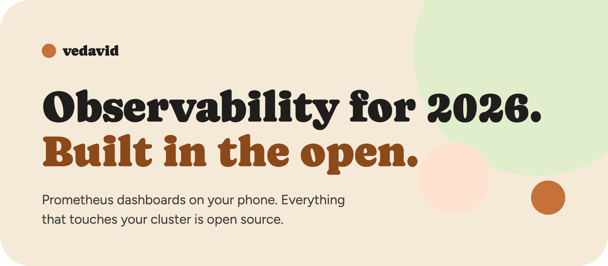
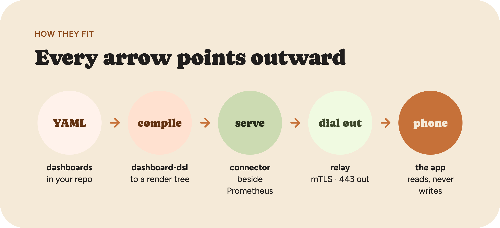
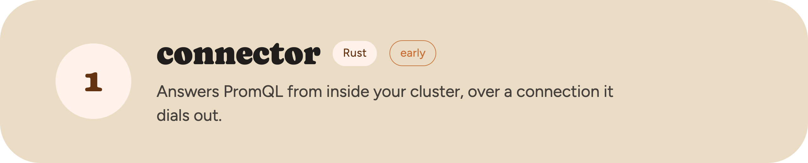
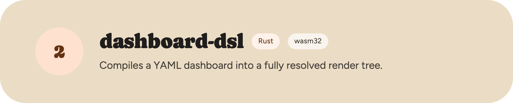
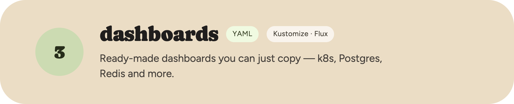
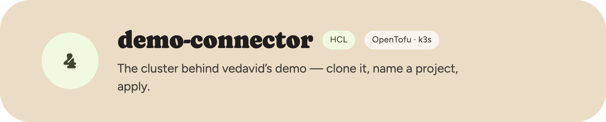

<a href="https://vedavid.dev"></a>

**vedavid** puts your Prometheus dashboards on your phone. Everything that touches your cluster — the connector, the dashboard compiler, the dashboards themselves — is open source under Apache-2.0. Read it before you run it.

[vedavid.dev](https://vedavid.dev) · [Docs](https://docs.vedavid.dev) · [Get the iOS app](https://testflight.apple.com/join/CTSQrsnb)

<br>



A dashboard starts as YAML in your repo and ends on a phone. Your metrics never leave the cluster — the only connection is the one the connector opens.

<br>

<a href="https://github.com/vedavid-dev/connector"></a>

Nothing is scraped, copied or shipped — a query arrives, it's forwarded to your Prometheus, the result goes back.

- No inbound ports, no Kubernetes permissions at all
- A bad merge keeps serving the last good dashboard
- Private key generated in-process; identity assigned by the relay

```
connector → relay · 443 out

InstantQuery   /api/v1/query
RangeQuery     /api/v1/query_range
Labels · LabelValues · Series
GetRenderTree  one compiled dashboard
```

<br>

<a href="https://github.com/vedavid-dev/dashboard-dsl"></a>

No defaults left to work out, no geometry to interpret. Order in the file is order on screen.

- A pure function: no filesystem, no network, no clock
- Every diagnostic in one run, each with a stable code and path
- A published conformance corpus for other implementations

```yaml
version: 1
id: k8s-namespace
title: Namespace
elements:
  - type: line
    title: CPU by pod
    unit: cores
    query: sum by (pod) (rate(container_cpu_usage_seconds_total[5m]))
```

<br>

<a href="https://github.com/vedavid-dev/dashboards"></a>

One directory per subject — `k8s`, `postgres`, `redis`, `rust-k8s-demo`. Take the ones your cluster has metrics for, pin a release, and they're on your phone within a minute.

```sh
kubectl apply -k https://github.com/vedavid-dev/dashboards//postgres?ref=v0.1.0
```

<br>

<a href="https://github.com/vedavid-dev/demo-connector"></a>

A one-node k3s on a GCP Spot VM with Prometheus, a synthetic workload worth watching, and the connector answering queries about it. Roughly $12–15 a month in your own project.

```sh
git clone https://github.com/vedavid-dev/demo-connector
cd demo-connector
tofu init
tofu apply -var project=your-project-id
```

<br>

> **Nothing we run ever opens a connection to you.**

Issues and pull requests are welcome — especially dashboards. If you run it, someone else does too.
